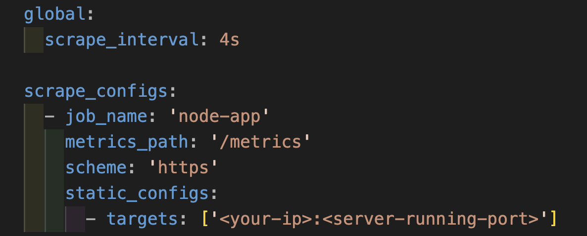
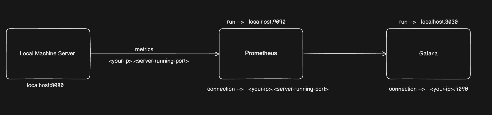
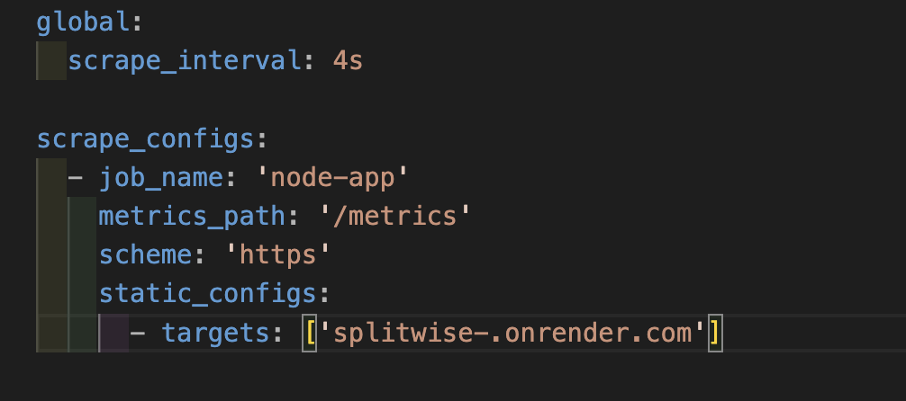
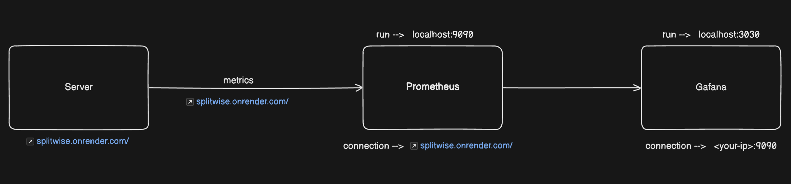

# SplitWise

A simple expense-sharing application.

## First of all, create a .env file before proceeding with the following steps.
    Create a `.env` file in the root directory and add the following variables:

    ```env
        PORT = ''
        MONGO_URL = ''
        CORS_ORIGIN = '*'
        ACCESS_TOKEN_SECRET = ''
        REFRESH_TOKEN_SECRET = ''
        ACCESS_TOKEN_EXPIRY = ''
        REFRESH_TOKEN_EXPIRY = ''
        REDIS_HOST = ''
        REDIS_PORT = ''
        REDIS_USERNAME = ''
        REDIS_PASSWORD = ''
        KAFKA_BROKER = ''
        KAFKA_SASL_USERNAME = ''
        KAFKA_SASL_PASSWORD = ''
        KAFKA_SSL_CA_PATH = './ca.cer'

    ```


## Installation of the backend code on your system

1. Clone the repository:

    ```sh
    git clone https://github.com/tanuj-saini/SplitWise.git
    cd splitwise
    ```

2. Install the dependencies:

    ```sh
    npm install
    ```


3. Start the development server:

    ```sh
    npm run dev
    ```

## Installation of the backend code using Docker

This application can also be run using Docker. Follow these steps:

1. Start the application using Docker Compose:

    ```sh
    docker-compose up -d
    ```

2. The application will be accessible at `http://localhost:7070`.

## Jenkins Setup

This application can be built and deployed using Jenkins. Follow these steps:

For Jenkins, simply copy the code from the Jenkinsfile, install the Pipeline plugin, paste the Jenkinsfile (pipeline code) into Jenkins, and run it
    
## Kubernetes Setup

This application can also be deployed using Kubernetes. Follow these steps:

1. **Create Kubernetes Deployment and Service Files**:
    Create a `deployment.yaml` file with the following content:

    ```yaml
    apiVersion: apps/v1
    kind: Deployment
    metadata:
      name: splitwise-deployment
    spec:
      replicas: 3
      selector:
        matchLabels:
          app: splitwise
      template:
        metadata:
          labels:
            app: splitwise
        spec:
          containers:
          - name: splitwise
            image: tanujsaini/splitwise-backend
            ports:
            - containerPort: 8080
            env:
            - name: PORT
              value: "8080"
            - name: MONGO_URL
               value: "your_mongodb_connection_string"
            - name: CORS_ORIGIN
              value: "your_cors_origin"
            - name: ACCESS_TOKEN_SECRET
              value: "your_access_token_secret"
            - name: REFRESH_TOKEN_SECRET
              value: "your_refresh_token_secret"
            - name: ACCESS_TOKEN_EXPIRY
              value: "your_access_token_expiry"
            - name: REFRESH_TOKEN_EXPIRY
              value: "your_refresh_token_expiry"
    ```

    Create a `service.yaml` file with the following content:

    ```yaml
    apiVersion: v1
    kind: Service
    metadata:
      name: splitwise-service
    spec:
      selector:
        app: splitwise
      ports:
       - protocol: TCP
          port: 80
          targetPort: 8080
      type: LoadBalancer
    ```
2. **Deploy to Kubernetes**:
    Apply the deployment and service files to your Kubernetes cluster:

    ```sh
    kubectl apply -f deployment.yaml
    kubectl apply -f service.yaml
    ```

3. **Access the Application**:
    The application will be accessible at the external IP address of the LoadBalancer service. You can get the external IP address by running:

    ```sh
    kubectl get services
    ```

## Grafana Prometheus Setup

1.  If your server is deployed on your local machine, then configure prometheus-config.yml as shown in the picture.
    

    The connection management looks like this
    


2.If your server is deployed on a cloud service or remote server, configure prometheus-config.yml accordingly as per the service requirements.
 

  The connection management looks like this
  
 


## Usage

To start the application without Docker, run:

```sh
npm start
